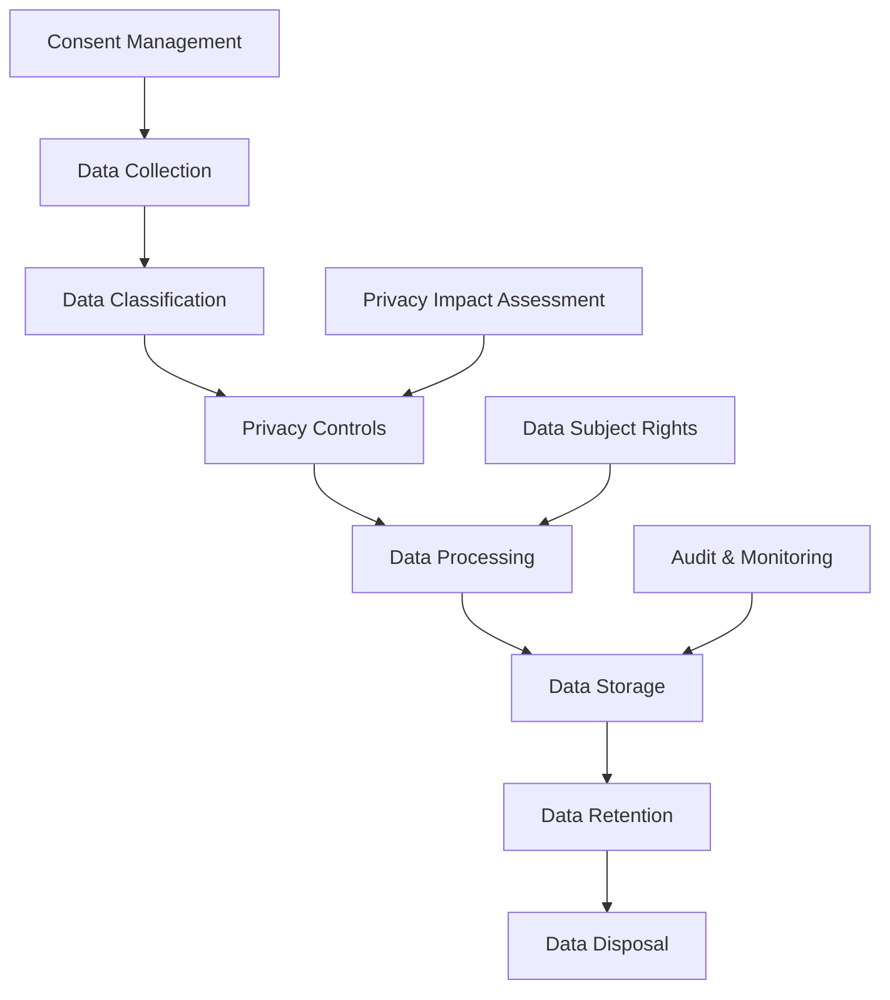

# Data Privacy - Data Protection and Privacy Compliance

This guide covers the comprehensive data privacy and protection measures implemented in the Retail Inventory Platform, including GDPR compliance, data classification, and privacy controls.

## Table of Contents

- [Data Privacy Overview](#data-privacy-overview)
- [Data Classification](#data-classification)
- [GDPR Compliance](#gdpr-compliance)
- [Data Protection Measures](#data-protection-measures)
- [Privacy Controls](#privacy-controls)
- [Data Retention](#data-retention)
- [Data Subject Rights](#data-subject-rights)
- [Privacy Impact Assessment](#privacy-impact-assessment)
- [Best Practices](#best-practices)
- [Troubleshooting](#troubleshooting)

## Data Privacy Overview

The Retail Inventory Platform implements comprehensive data privacy and protection measures to ensure compliance with international privacy regulations and protect sensitive business and personal data.

### Privacy Principles

- **Data Minimization**: Collect only necessary data
- **Purpose Limitation**: Use data only for specified purposes
- **Storage Limitation**: Retain data only as long as necessary
- **Accuracy**: Ensure data accuracy and currency
- **Security**: Protect data with appropriate safeguards
- **Transparency**: Provide clear information about data processing
- **Accountability**: Demonstrate compliance with privacy requirements

### Privacy Framework



## Data Classification

### Data Categories

#### Personal Data

```java
@Entity
@Table(name = "personal_data")
public class PersonalData {
    @Id
    @GeneratedValue(strategy = GenerationType.UUID)
    private UUID id;

    @Column(nullable = false)
    private String dataType; // PERSONAL, SENSITIVE, SPECIAL_CATEGORY

    @Column(nullable = false)
    private String category; // IDENTIFIERS, CONTACT, FINANCIAL, HEALTH

    @Column(nullable = false)
    private String sensitivity; // LOW, MEDIUM, HIGH, CRITICAL

    @Column(nullable = false)
    private String retentionPeriod;

    @Column(nullable = false)
    private String legalBasis;

    @Column(nullable = false)
    private boolean requiresConsent;

    // Getters and setters
}
```

#### Data Classification Levels

```java
public enum DataClassification {
    PUBLIC("Public", "No restrictions", "No protection required"),
    INTERNAL("Internal", "Company use only", "Basic protection required"),
    CONFIDENTIAL("Confidential", "Limited access", "Strong protection required"),
    RESTRICTED("Restricted", "Highly sensitive", "Maximum protection required");

    private final String name;
    private final String description;
    private final String protectionLevel;

    // Constructor and getters
}
```

### Data Inventory

#### Data Mapping

```java
@Service
public class DataInventoryService {

    @Autowired
    private DataClassificationRepository dataClassificationRepository;

    public DataInventoryResponse createDataInventory() {
        DataInventoryResponse inventory = new DataInventoryResponse();

        // Personal data inventory
        inventory.setPersonalData(collectPersonalData());

        // Business data inventory
        inventory.setBusinessData(collectBusinessData());

        // Technical data inventory
        inventory.setTechnicalData(collectTechnicalData());

        // Data flows
        inventory.setDataFlows(mapDataFlows());

        return inventory;
    }

    private List<PersonalDataRecord> collectPersonalData() {
        return dataClassificationRepository.findByDataType("PERSONAL");
    }

    private List<DataFlow> mapDataFlows() {
        List<DataFlow> flows = new ArrayList<>();

        // User registration flow
        flows.add(DataFlow.builder()
                .source("User Registration Form")
                .destination("User Database")
                .dataTypes(Arrays.asList("EMAIL", "NAME", "PHONE"))
                .purpose("User Account Creation")
                .legalBasis("CONSENT")
                .build());

        // Inventory tracking flow
        flows.add(DataFlow.builder()
                .source("Inventory System")
                .destination("Analytics Database")
                .dataTypes(Arrays.asList("PRODUCT_DATA", "SALES_DATA"))
                .purpose("Business Analytics")
                .legalBasis("LEGITIMATE_INTEREST")
                .build());

        return flows;
    }
}
```

## GDPR Compliance

### GDPR Principles Implementation

#### Lawfulness of Processing

```java
@Service
public class GdprComplianceService {

    @Autowired
    private ConsentRepository consentRepository;

    @Autowired
    private LegalBasisRepository legalBasisRepository;

    public boolean isProcessingLawful(String purpose, String dataType, UUID userId) {
        // Check if user has given consent
        if (requiresConsent(purpose, dataType)) {
            Consent consent = consentRepository.findByUserIdAndPurpose(userId, purpose);
            return consent != null && consent.isActive();
        }

        // Check legitimate interest
        if (hasLegitimateInterest(purpose, dataType)) {
            return true;
        }

        // Check contractual necessity
        if (isContractuallyNecessary(purpose, dataType)) {
            return true;
        }

        return false;
    }

    private boolean requiresConsent(String purpose, String dataType) {
        return legalBasisRepository.findByPurposeAndDataType(purpose, dataType)
                .map(LegalBasis::isRequiresConsent)
                .orElse(false);
    }
}
```

#### Data Minimization

```java
@Component
public class DataMinimizationService {

    public void minimizeDataCollection(DataCollectionRequest request) {
        // Remove unnecessary fields
        request.getFields().removeIf(field -> !isRequired(field));

        // Anonymize non-essential data
        request.getFields().forEach(field -> {
            if (!isEssential(field)) {
                field.setAnonymized(true);
            }
        });
    }

    private boolean isRequired(String field) {
        return REQUIRED_FIELDS.contains(field);
    }

    private boolean isEssential(String field) {
        return ESSENTIAL_FIELDS.contains(field);
    }
}
```

### Consent Management

#### Consent Collection

```java
@Entity
@Table(name = "consent_records")
public class ConsentRecord {
    @Id
    @GeneratedValue(strategy = GenerationType.UUID)
    private UUID id;

    @Column(nullable = false)
    private UUID userId;

    @Column(nullable = false)
    private String purpose;

    @Column(nullable = false)
    private String dataType;

    @Column(nullable = false)
    private boolean consentGiven;

    @Column(nullable = false)
    private LocalDateTime consentDate;

    @Column
    private LocalDateTime withdrawalDate;

    @Column(nullable = false)
    private String consentMethod; // EXPLICIT, IMPLICIT, OPT_IN, OPT_OUT

    @Column(columnDefinition = "TEXT")
    private String consentText;

    @Column(nullable = false)
    private boolean active = true;

    // Getters and setters
}
```

#### Consent Service

```java
@Service
public class ConsentService {

    @Autowired
    private ConsentRepository consentRepository;

    @Autowired
    private AuditService auditService;

    public ConsentResponse recordConsent(ConsentRequest request) {
        // Check if consent already exists
        ConsentRecord existingConsent = consentRepository
                .findByUserIdAndPurpose(request.getUserId(), request.getPurpose());

        if (existingConsent != null) {
            // Update existing consent
            existingConsent.setConsentGiven(request.isConsentGiven());
            existingConsent.setConsentDate(LocalDateTime.now());
            existingConsent.setConsentMethod(request.getConsentMethod());
            existingConsent.setConsentText(request.getConsentText());
            existingConsent.setActive(true);

            consentRepository.save(existingConsent);
        } else {
            // Create new consent record
            ConsentRecord consent = new ConsentRecord();
            consent.setUserId(request.getUserId());
            consent.setPurpose(request.getPurpose());
            consent.setDataType(request.getDataType());
            consent.setConsentGiven(request.isConsentGiven());
            consent.setConsentDate(LocalDateTime.now());
            consent.setConsentMethod(request.getConsentMethod());
            consent.setConsentText(request.getConsentText());

            consentRepository.save(consent);
        }

        // Log consent action
        auditService.logConsentAction(request.getUserId(), request.getPurpose(),
                request.isConsentGiven());

        return ConsentResponse.builder()
                .consentId(consent.getId())
                .consentGiven(request.isConsentGiven())
                .consentDate(LocalDateTime.now())
                .build();
    }

    public void withdrawConsent(UUID userId, String purpose) {
        ConsentRecord consent = consentRepository
                .findByUserIdAndPurpose(userId, purpose);

        if (consent != null) {
            consent.setConsentGiven(false);
            consent.setWithdrawalDate(LocalDateTime.now());
            consent.setActive(false);

            consentRepository.save(consent);

            // Log withdrawal
            auditService.logConsentWithdrawal(userId, purpose);
        }
    }
}
```

## Data Protection Measures

### Encryption

#### Data Encryption at Rest

```java
@Service
public class DataEncryptionService {

    @Value("${encryption.key}")
    private String encryptionKey;

    private SecretKeySpec secretKey;

    @PostConstruct
    public void init() {
        byte[] key = encryptionKey.getBytes(StandardCharsets.UTF_8);
        secretKey = new SecretKeySpec(key, "AES");
    }

    public String encryptSensitiveData(String data) {
        try {
            Cipher cipher = Cipher.getInstance("AES/GCM/NoPadding");
            cipher.init(Cipher.ENCRYPT_MODE, secretKey);

            byte[] encrypted = cipher.doFinal(data.getBytes());
            return Base64.getEncoder().encodeToString(encrypted);
        } catch (Exception e) {
            throw new EncryptionException("Failed to encrypt data", e);
        }
    }

    public String decryptSensitiveData(String encryptedData) {
        try {
            Cipher cipher = Cipher.getInstance("AES/GCM/NoPadding");
            cipher.init(Cipher.DECRYPT_MODE, secretKey);

            byte[] decoded = Base64.getDecoder().decode(encryptedData);
            byte[] decrypted = cipher.doFinal(decoded);
            return new String(decrypted);
        } catch (Exception e) {
            throw new EncryptionException("Failed to decrypt data", e);
        }
    }
}
```

#### Field-Level Encryption

```java
@Entity
@Table(name = "users")
public class User {
    @Id
    @GeneratedValue(strategy = GenerationType.UUID)
    private UUID id;

    @Column(nullable = false)
    private String username;

    @Column(nullable = false)
    @Convert(converter = EncryptedStringConverter.class)
    private String email;

    @Column(nullable = false)
    @Convert(converter = EncryptedStringConverter.class)
    private String phoneNumber;

    @Column(nullable = false)
    @Convert(converter = EncryptedStringConverter.class)
    private String address;

    // Getters and setters
}
```

### Data Masking

#### Dynamic Data Masking

```java
@Component
public class DataMaskingService {

    public String maskEmail(String email) {
        if (email == null || !email.contains("@")) {
            return email;
        }

        String[] parts = email.split("@");
        String username = parts[0];
        String domain = parts[1];

        if (username.length() <= 2) {
            return "***@" + domain;
        }

        String maskedUsername = username.charAt(0) + "***" + username.charAt(username.length() - 1);
        return maskedUsername + "@" + domain;
    }

    public String maskPhoneNumber(String phoneNumber) {
        if (phoneNumber == null || phoneNumber.length() < 4) {
            return phoneNumber;
        }

        return phoneNumber.substring(0, 3) + "***" + phoneNumber.substring(phoneNumber.length() - 4);
    }

    public String maskCreditCard(String cardNumber) {
        if (cardNumber == null || cardNumber.length() < 8) {
            return cardNumber;
        }

        return "****-****-****-" + cardNumber.substring(cardNumber.length() - 4);
    }

    public String maskSsn(String ssn) {
        if (ssn == null || ssn.length() < 4) {
            return ssn;
        }

        return "***-**-" + ssn.substring(ssn.length() - 4);
    }
}
```

### Access Controls

#### Data Access Control

```java
@Service
public class DataAccessControlService {

    @Autowired
    private UserRepository userRepository;

    @Autowired
    private DataClassificationRepository dataClassificationRepository;

    public boolean canAccessData(UUID userId, String dataType, String purpose) {
        User user = userRepository.findById(userId).orElse(null);
        if (user == null) return false;

        // Check user role permissions
        if (!hasRolePermission(user, dataType, purpose)) {
            return false;
        }

        // Check data classification
        DataClassification classification = dataClassificationRepository
                .findByDataType(dataType);

        if (classification == null) return false;

        // Check if user has required clearance level
        return hasRequiredClearance(user, classification.getSensitivity());
    }

    private boolean hasRolePermission(User user, String dataType, String purpose) {
        return user.getRoles().stream()
                .flatMap(role -> role.getPermissions().stream())
                .anyMatch(permission ->
                    permission.getResourceType().equals(dataType) &&
                    permission.getActionType().equals("READ")
                );
    }

    private boolean hasRequiredClearance(User user, String sensitivity) {
        String userClearance = user.getSecurityClearance();

        switch (sensitivity) {
            case "LOW":
                return true;
            case "MEDIUM":
                return Arrays.asList("MEDIUM", "HIGH", "CRITICAL").contains(userClearance);
            case "HIGH":
                return Arrays.asList("HIGH", "CRITICAL").contains(userClearance);
            case "CRITICAL":
                return "CRITICAL".equals(userClearance);
            default:
                return false;
        }
    }
}
```

## Privacy Controls

### Data Processing Controls

#### Purpose Limitation

```java
@Service
public class PurposeLimitationService {

    @Autowired
    private DataProcessingRepository dataProcessingRepository;

    public boolean isProcessingAllowed(String purpose, String dataType, UUID userId) {
        // Check if purpose is specified
        if (!isPurposeSpecified(purpose)) {
            return false;
        }

        // Check if user has consented to this purpose
        if (!hasUserConsent(userId, purpose)) {
            return false;
        }

        // Check if data type is compatible with purpose
        if (!isDataTypeCompatible(purpose, dataType)) {
            return false;
        }

        return true;
    }

    private boolean isPurposeSpecified(String purpose) {
        return SPECIFIED_PURPOSES.contains(purpose);
    }

    private boolean hasUserConsent(UUID userId, String purpose) {
        return consentRepository.findByUserIdAndPurpose(userId, purpose)
                .map(ConsentRecord::isConsentGiven)
                .orElse(false);
    }
}
```

#### Data Quality Controls

```java
@Service
public class DataQualityService {

    public void validateDataQuality(DataRecord record) {
        // Check data accuracy
        if (!isDataAccurate(record)) {
            throw new DataQualityException("Data accuracy validation failed");
        }

        // Check data completeness
        if (!isDataComplete(record)) {
            throw new DataQualityException("Data completeness validation failed");
        }

        // Check data currency
        if (!isDataCurrent(record)) {
            throw new DataQualityException("Data currency validation failed");
        }
    }

    private boolean isDataAccurate(DataRecord record) {
        // Implement accuracy checks
        return true;
    }

    private boolean isDataComplete(DataRecord record) {
        // Check required fields
        return record.getRequiredFields().stream()
                .allMatch(field -> field.getValue() != null && !field.getValue().isEmpty());
    }

    private boolean isDataCurrent(DataRecord record) {
        // Check if data is not older than retention period
        LocalDateTime lastUpdated = record.getLastUpdated();
        Duration retentionPeriod = record.getRetentionPeriod();

        return lastUpdated.isAfter(LocalDateTime.now().minus(retentionPeriod));
    }
}
```

### Privacy by Design

#### Privacy Impact Assessment

```java
@Service
public class PrivacyImpactAssessmentService {

    public PrivacyImpactAssessmentResponse conductPIA(PIARequest request) {
        PrivacyImpactAssessmentResponse pia = new PrivacyImpactAssessmentResponse();

        // Assess data collection
        pia.setDataCollectionAssessment(assessDataCollection(request));

        // Assess data processing
        pia.setDataProcessingAssessment(assessDataProcessing(request));

        // Assess data storage
        pia.setDataStorageAssessment(assessDataStorage(request));

        // Assess data sharing
        pia.setDataSharingAssessment(assessDataSharing(request));

        // Calculate risk score
        pia.setRiskScore(calculateRiskScore(pia));

        // Generate recommendations
        pia.setRecommendations(generateRecommendations(pia));

        return pia;
    }

    private DataCollectionAssessment assessDataCollection(PIARequest request) {
        DataCollectionAssessment assessment = new DataCollectionAssessment();

        // Check data minimization
        assessment.setDataMinimizationScore(assessDataMinimization(request));

        // Check consent requirements
        assessment.setConsentScore(assessConsentRequirements(request));

        // Check data quality
        assessment.setDataQualityScore(assessDataQuality(request));

        return assessment;
    }
}
```

## Data Retention

### Retention Policies

#### Data Retention Rules

```java
@Entity
@Table(name = "retention_policies")
public class RetentionPolicy {
    @Id
    @GeneratedValue(strategy = GenerationType.UUID)
    private UUID id;

    @Column(nullable = false)
    private String dataType;

    @Column(nullable = false)
    private String purpose;

    @Column(nullable = false)
    private Duration retentionPeriod;

    @Column(nullable = false)
    private String legalBasis;

    @Column(nullable = false)
    private String disposalMethod;

    @Column(nullable = false)
    private boolean active = true;

    // Getters and setters
}
```

#### Retention Service

```java
@Service
public class DataRetentionService {

    @Autowired
    private RetentionPolicyRepository retentionPolicyRepository;

    @Autowired
    private DataRepository dataRepository;

    public void processDataRetention() {
        List<RetentionPolicy> policies = retentionPolicyRepository.findActivePolicies();

        for (RetentionPolicy policy : policies) {
            processRetentionPolicy(policy);
        }
    }

    private void processRetentionPolicy(RetentionPolicy policy) {
        // Find data that has exceeded retention period
        List<DataRecord> expiredData = dataRepository.findExpiredData(
                policy.getDataType(),
                policy.getRetentionPeriod()
        );

        for (DataRecord record : expiredData) {
            if (shouldRetainData(record, policy)) {
                // Extend retention period
                extendRetentionPeriod(record, policy);
            } else {
                // Dispose of data
                disposeData(record, policy);
            }
        }
    }

    private boolean shouldRetainData(DataRecord record, RetentionPolicy policy) {
        // Check if data is subject to legal hold
        if (isUnderLegalHold(record)) {
            return true;
        }

        // Check if data is still needed for business purposes
        if (isStillNeeded(record)) {
            return true;
        }

        return false;
    }
}
```

### Data Disposal

#### Secure Data Disposal

```java
@Service
public class DataDisposalService {

    public void disposeData(DataRecord record, RetentionPolicy policy) {
        // Log disposal action
        logDataDisposal(record, policy);

        // Perform secure disposal
        performSecureDisposal(record, policy);

        // Update disposal record
        updateDisposalRecord(record, policy);
    }

    private void performSecureDisposal(DataRecord record, RetentionPolicy policy) {
        switch (policy.getDisposalMethod()) {
            case "DELETE":
                deleteData(record);
                break;
            case "ANONYMIZE":
                anonymizeData(record);
                break;
            case "PSEUDONYMIZE":
                pseudonymizeData(record);
                break;
            case "ARCHIVE":
                archiveData(record);
                break;
        }
    }

    private void deleteData(DataRecord record) {
        // Permanently delete data
        dataRepository.delete(record);
    }

    private void anonymizeData(DataRecord record) {
        // Remove all identifying information
        record.setPersonalIdentifiers(null);
        record.setAnonymized(true);
        dataRepository.save(record);
    }
}
```

## Data Subject Rights

### Right to Access

#### Data Subject Access Request

```java
@Service
public class DataSubjectAccessService {

    @Autowired
    private UserRepository userRepository;

    @Autowired
    private DataRepository dataRepository;

    public DataSubjectAccessResponse processAccessRequest(UUID userId) {
        // Verify user identity
        if (!verifyUserIdentity(userId)) {
            throw new IdentityVerificationException("User identity verification failed");
        }

        // Collect user data
        UserDataExport export = new UserDataExport();

        // Personal information
        export.setPersonalInfo(collectPersonalInfo(userId));

        // Activity logs
        export.setActivityLogs(collectActivityLogs(userId));

        // Preferences
        export.setPreferences(collectPreferences(userId));

        // Data processing information
        export.setDataProcessingInfo(collectDataProcessingInfo(userId));

        // Generate export file
        String exportFile = generateDataExportFile(export);

        return DataSubjectAccessResponse.builder()
                .exportFile(exportFile)
                .dataCategories(export.getDataCategories())
                .processingPurposes(export.getProcessingPurposes())
                .dataRetention(export.getDataRetention())
                .build();
    }
}
```

### Right to Rectification

#### Data Rectification

```java
@Service
public class DataRectificationService {

    public void processRectificationRequest(UUID userId, DataRectificationRequest request) {
        // Verify user identity
        if (!verifyUserIdentity(userId)) {
            throw new IdentityVerificationException("User identity verification failed");
        }

        // Validate rectification request
        validateRectificationRequest(request);

        // Process rectification
        for (DataField field : request.getFields()) {
            rectifiyDataField(userId, field);
        }

        // Log rectification
        auditService.logDataRectification(userId, request);
    }

    private void rectifiyDataField(UUID userId, DataField field) {
        // Update data field
        dataRepository.updateField(userId, field.getName(), field.getValue());

        // Log change
        auditService.logDataChange(userId, field.getName(), field.getOldValue(), field.getValue());
    }
}
```

### Right to Erasure

#### Data Erasure

```java
@Service
public class DataErasureService {

    public void processErasureRequest(UUID userId, DataErasureRequest request) {
        // Verify user identity
        if (!verifyUserIdentity(userId)) {
            throw new IdentityVerificationException("User identity verification failed");
        }

        // Check if erasure is legally required
        if (!isErasureRequired(userId, request)) {
            throw new ErasureNotRequiredException("Data erasure is not required");
        }

        // Process erasure
        eraseUserData(userId, request);

        // Log erasure
        auditService.logDataErasure(userId, request);
    }

    private void eraseUserData(UUID userId, DataErasureRequest request) {
        // Anonymize personal data
        anonymizePersonalData(userId);

        // Delete non-essential data
        deleteNonEssentialData(userId);

        // Update user status
        updateUserStatus(userId, "ERASED");
    }
}
```

## Privacy Impact Assessment

### PIA Process

#### PIA Implementation

```java
@Service
public class PrivacyImpactAssessmentService {

    public PrivacyImpactAssessmentResponse conductPIA(PIARequest request) {
        PrivacyImpactAssessmentResponse pia = new PrivacyImpactAssessmentResponse();

        // Assess data collection
        pia.setDataCollectionAssessment(assessDataCollection(request));

        // Assess data processing
        pia.setDataProcessingAssessment(assessDataProcessing(request));

        // Assess data storage
        pia.setDataStorageAssessment(assessDataStorage(request));

        // Assess data sharing
        pia.setDataSharingAssessment(assessDataSharing(request));

        // Calculate risk score
        pia.setRiskScore(calculateRiskScore(pia));

        // Generate recommendations
        pia.setRecommendations(generateRecommendations(pia));

        return pia;
    }

    private DataCollectionAssessment assessDataCollection(PIARequest request) {
        DataCollectionAssessment assessment = new DataCollectionAssessment();

        // Check data minimization
        assessment.setDataMinimizationScore(assessDataMinimization(request));

        // Check consent requirements
        assessment.setConsentScore(assessConsentRequirements(request));

        // Check data quality
        assessment.setDataQualityScore(assessDataQuality(request));

        return assessment;
    }
}
```

## Best Practices

### Privacy by Design

1. **Data Minimization**

   - Collect only necessary data
   - Use anonymization when possible
   - Implement data retention policies
   - Regular data audits

2. **Transparency**

   - Clear privacy notices
   - Easy-to-understand consent forms
   - Regular privacy updates
   - User-friendly privacy controls

3. **Security**
   - Encryption at rest and in transit
   - Access controls and authentication
   - Regular security assessments
   - Incident response procedures

### Compliance Management

1. **Regular Audits**

   - Privacy compliance audits
   - Data protection assessments
   - Security vulnerability scans
   - Third-party assessments

2. **Training and Awareness**

   - Privacy training for staff
   - Data protection awareness
   - Incident response training
   - Regular updates

3. **Documentation**
   - Privacy policies and procedures
   - Data processing records
   - Consent management
   - Incident response plans

## Troubleshooting

### Common Privacy Issues

#### Consent Management

**Symptoms:**

- Users cannot withdraw consent
- Consent records not found
- Consent validation failures

**Solutions:**

1. **Check Consent Records**

   ```java
   // Verify consent exists
   public boolean hasConsent(UUID userId, String purpose) {
       return consentRepository.findByUserIdAndPurpose(userId, purpose)
               .map(ConsentRecord::isConsentGiven)
               .orElse(false);
   }
   ```

2. **Update Consent Status**

   ```java
   // Update consent status
   public void updateConsent(UUID userId, String purpose, boolean consentGiven) {
       ConsentRecord consent = consentRepository.findByUserIdAndPurpose(userId, purpose)
               .orElse(new ConsentRecord());

       consent.setUserId(userId);
       consent.setPurpose(purpose);
       consent.setConsentGiven(consentGiven);
       consent.setConsentDate(LocalDateTime.now());

       consentRepository.save(consent);
   }
   ```

#### Data Access Issues

**Symptoms:**

- Users cannot access their data
- Data export failures
- Access request delays

**Solutions:**

1. **Verify User Identity**

   ```java
   // Verify user identity
   public boolean verifyUserIdentity(UUID userId, String verificationCode) {
       // Implement identity verification logic
       return identityVerificationService.verify(userId, verificationCode);
   }
   ```

2. **Generate Data Export**
   ```java
   // Generate data export
   public String generateDataExport(UUID userId) {
       UserDataExport export = collectUserData(userId);
       return exportService.generateExportFile(export);
   }
   ```

### Getting Help

1. **Privacy Documentation**: Check privacy documentation and guides
2. **Privacy Team**: Contact privacy team for complex issues
3. **Legal Team**: Contact legal team for compliance questions
4. **Training**: Attend privacy training sessions
5. **Community**: Join privacy community forums

---

_This data privacy guide is regularly updated. Check for the latest version and new features._
