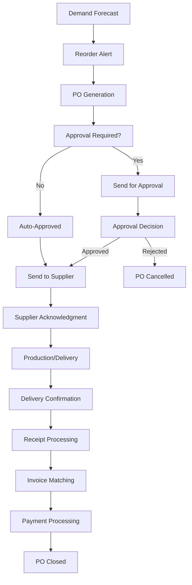

# Purchase Orders - PO Workflow and Automation

This guide covers the comprehensive purchase order management system in the Retail Inventory Platform, including automated PO generation, approval workflows, and supplier integration.

## Table of Contents

- [Overview](#overview)
- [PO Workflow](#po-workflow)
- [Automated PO Generation](#automated-po-generation)
- [Manual PO Creation](#manual-po-creation)
- [Approval Process](#approval-process)
- [Supplier Integration](#supplier-integration)
- [PO Tracking](#po-tracking)
- [API Reference](#api-reference)
- [Best Practices](#best-practices)
- [Troubleshooting](#troubleshooting)

## Overview

The Retail Inventory Platform provides comprehensive purchase order management capabilities designed to automate the procurement process while maintaining control and visibility. The system integrates with inventory management, demand forecasting, and supplier systems to create an efficient procurement workflow.

### Key Features

- **Automated PO Generation**: AI-powered purchase order creation based on demand forecasts
- **Approval Workflows**: Configurable approval processes for different PO types
- **Supplier Integration**: Electronic data interchange (EDI) and API integration
- **Real-time Tracking**: Monitor PO status from creation to delivery
- **Cost Management**: Track costs, budgets, and variances
- **Multi-Store Support**: Centralized PO management across multiple stores
- **Audit Trail**: Complete history of PO changes and approvals

## PO Workflow

### Complete PO Lifecycle



### PO Status Flow

```python
class POStatus(Enum):
    DRAFT = "DRAFT"                 # Initial creation
    PENDING_APPROVAL = "PENDING_APPROVAL"  # Awaiting approval
    APPROVED = "APPROVED"           # Approved and ready to send
    SENT = "SENT"                   # Sent to supplier
    ACKNOWLEDGED = "ACKNOWLEDGED"   # Supplier acknowledged
    IN_PRODUCTION = "IN_PRODUCTION" # Supplier producing/fulfilling
    SHIPPED = "SHIPPED"            # Order shipped
    DELIVERED = "DELIVERED"        # Delivered to store
    RECEIVED = "RECEIVED"          # Stock received and processed
    INVOICED = "INVOICED"          # Invoice received
    PAID = "PAID"                  # Payment processed
    CLOSED = "CLOSED"              # PO completed
    CANCELLED = "CANCELLED"        # PO cancelled
```

## Automated PO Generation

### Trigger Conditions

#### Reorder Point Triggers

```python
# Check if reorder point is reached
async def check_reorder_triggers(store_id: str, product_id: str):
    """
    Check if product needs reordering based on current stock
    """
    position = await get_inventory_position(store_id, product_id)

    # Check if below reorder point
    if position.quantity_available <= position.reorder_point:
        # Check if auto-reorder is enabled
        if await is_auto_reorder_enabled(store_id, product_id):
            # Generate automatic PO
            await generate_automatic_po(store_id, product_id)
        else:
            # Create reorder alert for manual review
            await create_reorder_alert(store_id, product_id)
```

#### Demand Forecast Triggers

```python
# Generate PO based on demand forecast
async def generate_forecast_based_po(
    store_id: str,
    product_id: str,
    forecast_horizon: int = 30
):
    """
    Generate PO based on demand forecast
    """
    # Get demand forecast
    forecast = await get_demand_forecast(
        store_id=store_id,
        product_id=product_id,
        horizon=forecast_horizon
    )

    # Calculate required quantity
    current_stock = await get_current_stock(store_id, product_id)
    forecasted_demand = forecast.total_demand
    safety_stock = await get_safety_stock(store_id, product_id)

    required_quantity = max(0, forecasted_demand - current_stock + safety_stock)

    if required_quantity > 0:
        await create_po_from_forecast(
            store_id=store_id,
            product_id=product_id,
            quantity=required_quantity,
            forecast_data=forecast
        )
```

### PO Generation Logic

#### Economic Order Quantity (EOQ)

```python
# Calculate EOQ for optimal order quantity
async def calculate_eoq(
    store_id: str,
    product_id: str,
    annual_demand: int,
    ordering_cost: float,
    holding_cost: float
) -> int:
    """
    Calculate Economic Order Quantity
    """
    if annual_demand <= 0 or ordering_cost <= 0 or holding_cost <= 0:
        return 0

    eoq = math.sqrt((2 * annual_demand * ordering_cost) / holding_cost)
    return int(eoq)
```

#### Reorder Quantity Calculation

```python
# Calculate optimal reorder quantity
async def calculate_reorder_quantity(
    store_id: str,
    product_id: str,
    lead_time_days: int,
    safety_stock_days: int
) -> int:
    """
    Calculate optimal reorder quantity
    """
    # Get demand forecast for lead time + safety stock
    forecast = await get_demand_forecast(
        store_id=store_id,
        product_id=product_id,
        horizon=lead_time_days + safety_stock_days
    )

    # Calculate required quantity
    required_quantity = forecast.average_daily_demand * (lead_time_days + safety_stock_days)

    # Apply EOQ if applicable
    eoq = await calculate_eoq(store_id, product_id, forecast.annual_demand, 50.0, 2.0)

    # Use the larger of required quantity or EOQ
    optimal_quantity = max(required_quantity, eoq)

    return int(optimal_quantity)
```

### Automated PO Creation

```python
# Create automated purchase order
async def create_automatic_po(
    store_id: str,
    product_id: str,
    quantity: int,
    trigger_type: str
):
    """
    Create automatic purchase order
    """
    # Get product and supplier information
    product = await get_product(product_id)
    supplier = await get_primary_supplier(product_id)

    if not supplier:
        raise NoSupplierError(f"No supplier found for product {product_id}")

    # Calculate costs
    cost_per_unit = await get_supplier_cost(supplier.id, product_id)
    total_cost = quantity * cost_per_unit

    # Create PO record
    po = await create_po_record(
        store_id=store_id,
        supplier_id=supplier.id,
        product_id=product_id,
        quantity=quantity,
        cost_per_unit=cost_per_unit,
        total_cost=total_cost,
        status="DRAFT",
        created_by="SYSTEM",
        trigger_type=trigger_type
    )

    # Add PO items
    await add_po_item(
        po_id=po.id,
        product_id=product_id,
        quantity=quantity,
        cost_per_unit=cost_per_unit,
        total_cost=total_cost
    )

    # Check if auto-approval is enabled
    if await is_auto_approval_enabled(store_id, supplier.id, total_cost):
        await auto_approve_po(po.id)
    else:
        await send_for_approval(po.id)

    return po
```

## Manual PO Creation

### PO Creation Form

#### Basic PO Information

```python
# Create manual purchase order
async def create_manual_po(
    store_id: str,
    supplier_id: str,
    requested_by: str,
    po_data: dict
):
    """
    Create manual purchase order
    """
    # Validate supplier
    supplier = await get_supplier(supplier_id)
    if not supplier:
        raise SupplierNotFoundError(f"Supplier {supplier_id} not found")

    # Create PO record
    po = await create_po_record(
        store_id=store_id,
        supplier_id=supplier_id,
        requested_by=requested_by,
        status="DRAFT",
        po_number=await generate_po_number(),
        **po_data
    )

    return po
```

#### PO Item Management

```python
# Add items to purchase order
async def add_po_items(po_id: str, items: list):
    """
    Add items to purchase order
    """
    for item in items:
        # Validate product
        product = await get_product(item["product_id"])
        if not product:
            raise ProductNotFoundError(f"Product {item['product_id']} not found")

        # Calculate costs
        cost_per_unit = item.get("cost_per_unit")
        if not cost_per_unit:
            cost_per_unit = await get_supplier_cost(po.supplier_id, item["product_id"])

        total_cost = item["quantity"] * cost_per_unit

        # Add PO item
        await add_po_item(
            po_id=po_id,
            product_id=item["product_id"],
            quantity=item["quantity"],
            cost_per_unit=cost_per_unit,
            total_cost=total_cost,
            notes=item.get("notes", "")
        )

    # Recalculate PO totals
    await recalculate_po_totals(po_id)
```

### PO Templates

#### Template Creation

```python
# Create PO template
async def create_po_template(
    name: str,
    store_id: str,
    supplier_id: str,
    items: list,
    created_by: str
):
    """
    Create reusable PO template
    """
    template = await create_template_record(
        name=name,
        store_id=store_id,
        supplier_id=supplier_id,
        created_by=created_by,
        status="ACTIVE"
    )

    # Add template items
    for item in items:
        await add_template_item(
            template_id=template.id,
            product_id=item["product_id"],
            quantity=item["quantity"],
            cost_per_unit=item.get("cost_per_unit"),
            notes=item.get("notes", "")
        )

    return template
```

#### Template Usage

```python
# Create PO from template
async def create_po_from_template(template_id: str, requested_by: str):
    """
    Create purchase order from template
    """
    template = await get_po_template(template_id)
    if not template:
        raise TemplateNotFoundError(f"Template {template_id} not found")

    # Create PO from template
    po = await create_po_record(
        store_id=template.store_id,
        supplier_id=template.supplier_id,
        requested_by=requested_by,
        status="DRAFT",
        template_id=template_id
    )

    # Copy template items
    template_items = await get_template_items(template_id)
    for item in template_items:
        await add_po_item(
            po_id=po.id,
            product_id=item.product_id,
            quantity=item.quantity,
            cost_per_unit=item.cost_per_unit,
            total_cost=item.quantity * item.cost_per_unit,
            notes=item.notes
        )

    return po
```

## Approval Process

### Approval Workflow Configuration

#### Workflow Rules

```python
# Configure approval workflow
async def configure_approval_workflow(
    store_id: str,
    supplier_id: str,
    amount_threshold: float,
    approvers: list,
    auto_approve: bool = False
):
    """
    Configure approval workflow for POs
    """
    workflow = await create_approval_workflow(
        store_id=store_id,
        supplier_id=supplier_id,
        amount_threshold=amount_threshold,
        auto_approve=auto_approve,
        status="ACTIVE"
    )

    # Add approvers
    for approver in approvers:
        await add_workflow_approver(
            workflow_id=workflow.id,
            user_id=approver["user_id"],
            approval_level=approver["level"],
            required=approver.get("required", True)
        )

    return workflow
```

#### Approval Logic

```python
# Determine approval requirements
async def determine_approval_requirements(po_id: str):
    """
    Determine what approvals are required for PO
    """
    po = await get_po_record(po_id)

    # Get applicable workflow
    workflow = await get_approval_workflow(
        store_id=po.store_id,
        supplier_id=po.supplier_id,
        amount=po.total_cost
    )

    if not workflow:
        # Use default workflow
        workflow = await get_default_approval_workflow(po.store_id)

    if workflow.auto_approve:
        return {"auto_approve": True}

    # Get required approvers
    approvers = await get_required_approvers(workflow.id)

    return {
        "auto_approve": False,
        "approvers": approvers,
        "workflow_id": workflow.id
    }
```

### Approval Processing

#### Submit for Approval

```python
# Submit PO for approval
async def submit_for_approval(po_id: str, submitted_by: str):
    """
    Submit purchase order for approval
    """
    # Get approval requirements
    requirements = await determine_approval_requirements(po_id)

    if requirements["auto_approve"]:
        # Auto-approve PO
        await auto_approve_po(po_id, submitted_by)
    else:
        # Create approval requests
        for approver in requirements["approvers"]:
            await create_approval_request(
                po_id=po_id,
                approver_id=approver["user_id"],
                approval_level=approver["level"],
                required=approver["required"]
            )

        # Update PO status
        await update_po_status(po_id, "PENDING_APPROVAL")

        # Send notifications
        await send_approval_notifications(po_id, requirements["approvers"])
```

#### Approval Decision

```python
# Process approval decision
async def process_approval_decision(
    approval_id: str,
    decision: str,
    comments: str,
    approved_by: str
):
    """
    Process approval decision
    """
    # Update approval record
    await update_approval_record(
        approval_id=approval_id,
        decision=decision,
        comments=comments,
        approved_by=approved_by,
        approved_at=datetime.now()
    )

    # Check if all required approvals received
    po_id = await get_po_id_from_approval(approval_id)
    all_approved = await check_all_approvals_received(po_id)

    if all_approved:
        # All approvals received, approve PO
        await approve_po(po_id)
    elif decision == "REJECTED":
        # Rejection received, cancel PO
        await reject_po(po_id, comments)
```

## Supplier Integration

### EDI Integration

#### EDI Message Types

```python
# EDI message types for PO processing
class EDIMessageType(Enum):
    PO_850 = "850"           # Purchase Order
    POA_855 = "855"         # Purchase Order Acknowledgment
    ASN_856 = "856"         # Advance Ship Notice
    INVOICE_810 = "810"     # Invoice
    REMITTANCE_820 = "820"  # Remittance Advice
```

#### EDI Message Processing

```python
# Process EDI message
async def process_edi_message(message_type: str, message_data: dict):
    """
    Process incoming EDI message
    """
    if message_type == "855":  # PO Acknowledgment
        await process_po_acknowledgment(message_data)
    elif message_type == "856":  # Advance Ship Notice
        await process_advance_ship_notice(message_data)
    elif message_type == "810":  # Invoice
        await process_supplier_invoice(message_data)
    else:
        raise UnsupportedEDIMessageError(f"Unsupported EDI message type: {message_type}")
```

#### PO Acknowledgment Processing

```python
# Process PO acknowledgment
async def process_po_acknowledgment(ack_data: dict):
    """
    Process supplier PO acknowledgment
    """
    po_id = ack_data["po_id"]
    acknowledgment_status = ack_data["status"]

    if acknowledgment_status == "ACCEPTED":
        await update_po_status(po_id, "ACKNOWLEDGED")
        await update_po_acknowledgment_date(po_id, datetime.now())
    elif acknowledgment_status == "REJECTED":
        await update_po_status(po_id, "REJECTED")
        await log_po_rejection(po_id, ack_data["rejection_reason"])

    # Send notification
    await send_po_acknowledgment_notification(po_id, acknowledgment_status)
```

### API Integration

#### Supplier API Client

```python
# Supplier API client
class SupplierAPIClient:
    def __init__(self, supplier_id: str, api_key: str):
        self.supplier_id = supplier_id
        self.api_key = api_key
        self.base_url = await get_supplier_api_url(supplier_id)

    async def send_po(self, po_data: dict):
        """
        Send purchase order to supplier
        """
        headers = {
            "Authorization": f"Bearer {self.api_key}",
            "Content-Type": "application/json"
        }

        response = await httpx.post(
            f"{self.base_url}/api/purchase-orders",
            json=po_data,
            headers=headers
        )

        if response.status_code == 200:
            return response.json()
        else:
            raise SupplierAPIError(f"Failed to send PO: {response.text}")

    async def get_po_status(self, po_id: str):
        """
        Get PO status from supplier
        """
        headers = {"Authorization": f"Bearer {self.api_key}"}

        response = await httpx.get(
            f"{self.base_url}/api/purchase-orders/{po_id}",
            headers=headers
        )

        if response.status_code == 200:
            return response.json()
        else:
            raise SupplierAPIError(f"Failed to get PO status: {response.text}")
```

## PO Tracking

### Status Tracking

#### PO Status Updates

```python
# Update PO status
async def update_po_status(po_id: str, new_status: str, updated_by: str = None):
    """
    Update purchase order status
    """
    # Validate status transition
    current_status = await get_po_status(po_id)
    if not is_valid_status_transition(current_status, new_status):
        raise InvalidStatusTransitionError(
            f"Cannot transition from {current_status} to {new_status}"
        )

    # Update status
    await update_po_record(
        po_id=po_id,
        status=new_status,
        updated_by=updated_by,
        updated_at=datetime.now()
    )

    # Log status change
    await log_po_status_change(
        po_id=po_id,
        old_status=current_status,
        new_status=new_status,
        updated_by=updated_by
    )

    # Send notifications
    await send_status_change_notifications(po_id, new_status)
```

#### Delivery Tracking

```python
# Track delivery status
async def update_delivery_status(
    po_id: str,
    delivery_status: str,
    tracking_number: str = None,
    estimated_delivery: datetime = None
):
    """
    Update delivery status for PO
    """
    await update_po_record(
        po_id=po_id,
        delivery_status=delivery_status,
        tracking_number=tracking_number,
        estimated_delivery=estimated_delivery,
        updated_at=datetime.now()
    )

    # Send delivery notifications
    await send_delivery_notifications(po_id, delivery_status)
```

### Cost Tracking

#### Cost Variance Analysis

```python
# Analyze cost variances
async def analyze_cost_variances(po_id: str):
    """
    Analyze cost variances for PO
    """
    po = await get_po_record(po_id)
    actual_costs = await get_actual_costs(po_id)

    variances = []
    for item in po.items:
        planned_cost = item.quantity * item.cost_per_unit
        actual_cost = actual_costs.get(item.product_id, 0)
        variance = actual_cost - planned_cost
        variance_pct = (variance / planned_cost) * 100 if planned_cost > 0 else 0

        variances.append({
            "product_id": item.product_id,
            "planned_cost": planned_cost,
            "actual_cost": actual_cost,
            "variance": variance,
            "variance_pct": variance_pct
        })

    return variances
```

#### Budget Impact Analysis

```python
# Analyze budget impact
async def analyze_budget_impact(store_id: str, period_start: datetime, period_end: datetime):
    """
    Analyze budget impact of POs
    """
    # Get POs for period
    pos = await get_pos_for_period(store_id, period_start, period_end)

    # Calculate budget impact
    total_po_value = sum(po.total_cost for po in pos)
    budget_allocation = await get_budget_allocation(store_id, period_start, period_end)

    budget_utilization = (total_po_value / budget_allocation) * 100 if budget_allocation > 0 else 0

    return {
        "total_po_value": total_po_value,
        "budget_allocation": budget_allocation,
        "budget_utilization": budget_utilization,
        "remaining_budget": budget_allocation - total_po_value
    }
```

## API Reference

### PO Management Endpoints

#### Create Purchase Order

```http
POST /api/purchase-orders
Content-Type: application/json
Authorization: Bearer {token}

{
    "store_id": "uuid",
    "supplier_id": "uuid",
    "requested_by": "uuid",
    "items": [
        {
            "product_id": "uuid",
            "quantity": 100,
            "cost_per_unit": 25.99,
            "notes": "Urgent restock"
        }
    ],
    "delivery_date": "2024-02-15",
    "notes": "Monthly restock order"
}
```

**Response:**

```json
{
  "po_id": "uuid",
  "po_number": "PO-2024-001",
  "status": "DRAFT",
  "total_cost": 2599.0,
  "created_at": "2024-01-15T10:30:00Z"
}
```

#### Get Purchase Order

```http
GET /api/purchase-orders/{po_id}
Authorization: Bearer {token}
```

**Response:**

```json
{
  "po_id": "uuid",
  "po_number": "PO-2024-001",
  "store_id": "uuid",
  "supplier_id": "uuid",
  "status": "APPROVED",
  "total_cost": 2599.0,
  "items": [
    {
      "product_id": "uuid",
      "quantity": 100,
      "cost_per_unit": 25.99,
      "total_cost": 2599.0
    }
  ],
  "created_at": "2024-01-15T10:30:00Z",
  "approved_at": "2024-01-15T14:30:00Z"
}
```

#### Submit for Approval

```http
POST /api/purchase-orders/{po_id}/submit-approval
Authorization: Bearer {token}
```

#### Approve/Reject PO

```http
POST /api/purchase-orders/{po_id}/approve
Content-Type: application/json
Authorization: Bearer {token}

{
    "decision": "APPROVED",
    "comments": "Approved for urgent restock"
}
```

### PO Tracking Endpoints

#### Get PO Status

```http
GET /api/purchase-orders/{po_id}/status
Authorization: Bearer {token}
```

#### Update Delivery Status

```http
POST /api/purchase-orders/{po_id}/delivery-status
Content-Type: application/json
Authorization: Bearer {token}

{
    "delivery_status": "SHIPPED",
    "tracking_number": "TRK123456789",
    "estimated_delivery": "2024-01-20T10:00:00Z"
}
```

### PO Analytics Endpoints

#### Get PO Analytics

```http
GET /api/purchase-orders/analytics?store_id={store_id}&start_date={start_date}&end_date={end_date}
Authorization: Bearer {token}
```

**Response:**

```json
{
  "total_pos": 150,
  "total_value": 125000.0,
  "average_po_value": 833.33,
  "approval_rate": 95.5,
  "delivery_performance": {
    "on_time": 92.0,
    "late": 8.0
  },
  "cost_variances": {
    "positive": 5.2,
    "negative": -3.1
  }
}
```

## Best Practices

### PO Management

1. **Automated Reordering**

   - Set up automated reorder points
   - Use demand forecasting for optimal quantities
   - Implement safety stock calculations

2. **Approval Workflows**

   - Configure appropriate approval levels
   - Set up escalation procedures
   - Implement approval timeouts

3. **Supplier Relationships**
   - Maintain supplier performance metrics
   - Negotiate better terms and conditions
   - Establish backup suppliers

### Cost Management

1. **Budget Control**

   - Set up budget limits and alerts
   - Monitor spending against budgets
   - Implement cost approval thresholds

2. **Variance Analysis**

   - Track cost variances regularly
   - Investigate significant variances
   - Adjust forecasts based on actual costs

3. **Negotiation**
   - Use historical data for negotiations
   - Leverage volume discounts
   - Consider total cost of ownership

### Process Optimization

1. **Workflow Efficiency**

   - Streamline approval processes
   - Automate routine tasks
   - Implement exception handling

2. **Data Quality**

   - Maintain accurate supplier data
   - Validate cost information
   - Ensure complete audit trails

3. **Performance Monitoring**
   - Track PO cycle times
   - Monitor approval rates
   - Measure supplier performance

## Troubleshooting

### Common Issues

#### PO Approval Delays

**Symptoms:**

- POs stuck in approval status
- Approvers not receiving notifications
- Approval timeouts

**Solutions:**

1. **Check Approval Workflow**

   ```python
   # Verify approval workflow configuration
   workflow = await get_approval_workflow(po_id)
   approvers = await get_required_approvers(workflow.id)
   ```

2. **Send Reminder Notifications**

   ```python
   # Send reminder notifications
   await send_approval_reminders(po_id)
   ```

3. **Escalate to Manager**
   ```python
   # Escalate to manager if timeout reached
   if await is_approval_timeout_reached(po_id):
       await escalate_approval(po_id)
   ```

#### Supplier Integration Issues

**Symptoms:**

- EDI messages not processing
- API integration failures
- Data synchronization problems

**Solutions:**

1. **Check EDI Configuration**

   ```python
   # Verify EDI configuration
   edi_config = await get_edi_configuration(supplier_id)
   ```

2. **Test API Connectivity**

   ```python
   # Test supplier API connectivity
   client = SupplierAPIClient(supplier_id, api_key)
   status = await client.test_connection()
   ```

3. **Review Error Logs**
   ```python
   # Review integration error logs
   errors = await get_integration_errors(supplier_id, start_date, end_date)
   ```

#### Cost Variance Issues

**Symptoms:**

- Significant cost variances
- Budget overruns
- Inaccurate cost estimates

**Solutions:**

1. **Analyze Cost Variances**

   ```python
   # Analyze cost variances
   variances = await analyze_cost_variances(po_id)
   ```

2. **Update Cost Estimates**

   ```python
   # Update cost estimates based on actual costs
   await update_cost_estimates(product_id, actual_costs)
   ```

3. **Review Supplier Pricing**
   ```python
   # Review supplier pricing agreements
   pricing = await get_supplier_pricing(supplier_id, product_id)
   ```

### Performance Issues

#### Slow PO Processing

**Symptoms:**

- Long response times for PO operations
- Timeout errors during creation
- Database connection issues

**Solutions:**

1. **Optimize Database Queries**

   ```sql
   -- Add indexes for better performance
   CREATE INDEX idx_purchase_orders_store_status ON purchase_orders(store_id, status);
   CREATE INDEX idx_po_items_po_product ON po_items(po_id, product_id);
   ```

2. **Implement Caching**

   ```python
   # Cache frequently accessed data
   @lru_cache(maxsize=1000)
   async def get_cached_supplier_info(supplier_id):
       return await get_supplier(supplier_id)
   ```

3. **Use Async Processing**
   ```python
   # Use async processing for bulk operations
   async def bulk_create_pos(po_data_list):
       tasks = [create_po(po_data) for po_data in po_data_list]
       await asyncio.gather(*tasks)
   ```

### Getting Help

1. **Documentation**: Check API documentation and user guides
2. **Logs**: Review application logs for error details
3. **Support**: Contact technical support for complex issues
4. **Training**: Attend PO management training sessions
5. **Community**: Join user community forums

---

_This purchase orders guide is regularly updated. Check for the latest version and new features._
