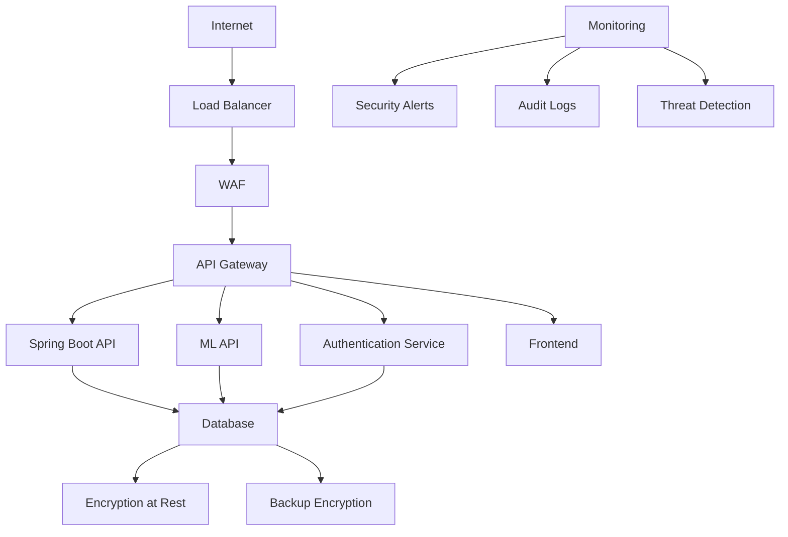

# Security Guide - Security Best Practices and Implementation

This guide covers the comprehensive security implementation of the Retail Inventory Platform, including authentication, authorization, data protection, and compliance measures.

## Table of Contents

- [Security Overview](#security-overview)
- [Authentication & Authorization](#authentication--authorization)
- [Data Protection](#data-protection)
- [Network Security](#network-security)
- [Application Security](#application-security)
- [Infrastructure Security](#infrastructure-security)
- [Compliance & Auditing](#compliance--auditing)
- [Security Monitoring](#security-monitoring)
- [Incident Response](#incident-response)
- [Best Practices](#best-practices)
- [Troubleshooting](#troubleshooting)

## Security Overview

The Retail Inventory Platform implements a comprehensive security framework designed to protect sensitive business data, ensure regulatory compliance, and maintain system integrity across all components.

### Security Principles

- **Defense in Depth**: Multiple layers of security controls
- **Least Privilege**: Users and systems have minimum required access
- **Zero Trust**: Verify and authenticate all access attempts
- **Data Classification**: Protect data based on sensitivity levels
- **Continuous Monitoring**: Real-time security monitoring and alerting
- **Incident Response**: Rapid response to security threats

### Security Architecture



## Authentication & Authorization

### JWT Authentication

#### Token Structure

```json
{
  "header": {
    "alg": "RS256",
    "typ": "JWT"
  },
  "payload": {
    "sub": "user-uuid",
    "iss": "retail-inventory-platform",
    "aud": "retail-inventory-api",
    "exp": 1640995200,
    "iat": 1640908800,
    "roles": ["MANAGER", "STORE_ACCESS"],
    "permissions": ["READ_INVENTORY", "WRITE_PURCHASE_ORDERS"],
    "store_access": ["store-uuid-1", "store-uuid-2"]
  }
}
```

#### Token Generation

```java
@Service
public class JwtService {

    @Value("${jwt.secret}")
    private String secret;

    @Value("${jwt.expiration}")
    private Long expiration;

    public String generateToken(UserDetails userDetails) {
        Map<String, Object> claims = new HashMap<>();
        claims.put("roles", userDetails.getAuthorities());
        claims.put("permissions", getPermissions(userDetails));
        claims.put("store_access", getStoreAccess(userDetails));

        return createToken(claims, userDetails.getUsername());
    }

    private String createToken(Map<String, Object> claims, String subject) {
        return Jwts.builder()
                .setClaims(claims)
                .setSubject(subject)
                .setIssuedAt(new Date(System.currentTimeMillis()))
                .setExpiration(new Date(System.currentTimeMillis() + expiration))
                .signWith(SignatureAlgorithm.HS256, secret)
                .compact();
    }
}
```

#### Token Validation

```java
@Component
public class JwtAuthenticationFilter extends OncePerRequestFilter {

    @Autowired
    private JwtService jwtService;

    @Autowired
    private UserDetailsService userDetailsService;

    @Override
    protected void doFilterInternal(HttpServletRequest request,
                                  HttpServletResponse response,
                                  FilterChain filterChain) throws ServletException, IOException {

        String token = extractTokenFromRequest(request);

        if (token != null && jwtService.validateToken(token)) {
            String username = jwtService.extractUsername(token);
            UserDetails userDetails = userDetailsService.loadUserByUsername(username);

            if (jwtService.validateToken(token, userDetails)) {
                UsernamePasswordAuthenticationToken authToken =
                    new UsernamePasswordAuthenticationToken(userDetails, null, userDetails.getAuthorities());
                SecurityContextHolder.getContext().setAuthentication(authToken);
            }
        }

        filterChain.doFilter(request, response);
    }
}
```

### Role-Based Access Control (RBAC)

#### Role Definition

```java
@Entity
@Table(name = "roles")
public class Role {
    @Id
    @GeneratedValue(strategy = GenerationType.UUID)
    private UUID id;

    @Column(unique = true, nullable = false)
    private String name;

    @Column(length = 500)
    private String description;

    @ManyToMany(fetch = FetchType.EAGER)
    @JoinTable(
        name = "role_permissions",
        joinColumns = @JoinColumn(name = "role_id"),
        inverseJoinColumns = @JoinColumn(name = "permission_id")
    )
    private Set<Permission> permissions;

    // Getters and setters
}
```

#### Permission System

```java
@Entity
@Table(name = "permissions")
public class Permission {
    @Id
    @GeneratedValue(strategy = GenerationType.UUID)
    private UUID id;

    @Column(unique = true, nullable = false)
    private String name;

    @Column(length = 500)
    private String description;

    @Column(name = "resource_type")
    private String resourceType;

    @Column(name = "action_type")
    private String actionType;

    // Getters and setters
}
```

#### Access Control Implementation

```java
@RestController
@RequestMapping("/api/inventory")
@PreAuthorize("hasRole('MANAGER') or hasRole('STORE_MANAGER')")
public class InventoryController {

    @GetMapping("/positions/{storeId}")
    @PreAuthorize("hasPermission(#storeId, 'STORE', 'READ')")
    public ResponseEntity<List<InventoryPosition>> getInventoryPositions(
            @PathVariable String storeId,
            @RequestParam(defaultValue = "0") int page,
            @RequestParam(defaultValue = "20") int size) {

        // Implementation
    }

    @PostMapping("/positions")
    @PreAuthorize("hasPermission('INVENTORY', 'WRITE')")
    public ResponseEntity<InventoryPosition> createInventoryPosition(
            @RequestBody @Valid InventoryPositionRequest request) {

        // Implementation
    }
}
```

### Multi-Factor Authentication (MFA)

#### MFA Implementation

```java
@Service
public class MfaService {

    @Autowired
    private TotpService totpService;

    @Autowired
    private EmailService emailService;

    @Autowired
    private SmsService smsService;

    public MfaSetupResponse setupMfa(UUID userId) {
        String secret = totpService.generateSecret();
        String qrCodeUrl = totpService.generateQrCodeUrl(userId, secret);

        // Save secret to user record
        userService.saveMfaSecret(userId, secret);

        return MfaSetupResponse.builder()
                .secret(secret)
                .qrCodeUrl(qrCodeUrl)
                .backupCodes(generateBackupCodes())
                .build();
    }

    public boolean verifyMfaCode(UUID userId, String code) {
        String secret = userService.getMfaSecret(userId);
        return totpService.verifyCode(secret, code);
    }

    public void sendMfaCode(UUID userId, String method) {
        String code = generateMfaCode();

        switch (method) {
            case "EMAIL":
                emailService.sendMfaCode(userId, code);
                break;
            case "SMS":
                smsService.sendMfaCode(userId, code);
                break;
        }

        // Store code with expiration
        mfaCodeService.storeCode(userId, code, Duration.ofMinutes(5));
    }
}
```

## Data Protection

### Encryption at Rest

#### Database Encryption

```sql
-- Enable encryption for sensitive tables
ALTER TABLE users ALTER COLUMN password SET ENCRYPTED;
ALTER TABLE users ALTER COLUMN email SET ENCRYPTED;
ALTER TABLE suppliers ALTER COLUMN bank_account SET ENCRYPTED;

-- Create encrypted columns for sensitive data
ALTER TABLE inventory_positions ADD COLUMN cost_per_unit_encrypted BYTEA;
ALTER TABLE purchase_orders ADD COLUMN total_cost_encrypted BYTEA;
```

#### Application-Level Encryption

```java
@Service
public class EncryptionService {

    @Value("${encryption.key}")
    private String encryptionKey;

    private SecretKeySpec secretKey;

    @PostConstruct
    public void init() {
        byte[] key = encryptionKey.getBytes(StandardCharsets.UTF_8);
        secretKey = new SecretKeySpec(key, "AES");
    }

    public String encrypt(String data) {
        try {
            Cipher cipher = Cipher.getInstance("AES/ECB/PKCS5Padding");
            cipher.init(Cipher.ENCRYPT_MODE, secretKey);
            byte[] encrypted = cipher.doFinal(data.getBytes());
            return Base64.getEncoder().encodeToString(encrypted);
        } catch (Exception e) {
            throw new EncryptionException("Failed to encrypt data", e);
        }
    }

    public String decrypt(String encryptedData) {
        try {
            Cipher cipher = Cipher.getInstance("AES/ECB/PKCS5Padding");
            cipher.init(Cipher.DECRYPT_MODE, secretKey);
            byte[] decoded = Base64.getDecoder().decode(encryptedData);
            byte[] decrypted = cipher.doFinal(decoded);
            return new String(decrypted);
        } catch (Exception e) {
            throw new EncryptionException("Failed to decrypt data", e);
        }
    }
}
```

### Encryption in Transit

#### TLS Configuration

```yaml
# Spring Boot TLS configuration
server:
  ssl:
    enabled: true
    key-store: classpath:keystore.p12
    key-store-password: ${SSL_KEYSTORE_PASSWORD}
    key-store-type: PKCS12
    key-alias: retail-inventory
    trust-store: classpath:truststore.p12
    trust-store-password: ${SSL_TRUSTSTORE_PASSWORD}
    trust-store-type: PKCS12
    client-auth: want
    enabled-protocols: TLSv1.2,TLSv1.3
    ciphers: TLS_ECDHE_RSA_WITH_AES_256_GCM_SHA384,TLS_ECDHE_RSA_WITH_AES_128_GCM_SHA256
```

#### API Security Headers

```java
@Configuration
public class SecurityHeadersConfig {

    @Bean
    public FilterRegistrationBean<SecurityHeadersFilter> securityHeadersFilter() {
        FilterRegistrationBean<SecurityHeadersFilter> registration = new FilterRegistrationBean<>();
        registration.setFilter(new SecurityHeadersFilter());
        registration.addUrlPatterns("/*");
        return registration;
    }

    public static class SecurityHeadersFilter implements Filter {
        @Override
        public void doFilter(ServletRequest request, ServletResponse response, FilterChain chain)
                throws IOException, ServletException {

            HttpServletResponse httpResponse = (HttpServletResponse) response;

            // Security headers
            httpResponse.setHeader("Strict-Transport-Security", "max-age=31536000; includeSubDomains");
            httpResponse.setHeader("X-Content-Type-Options", "nosniff");
            httpResponse.setHeader("X-Frame-Options", "DENY");
            httpResponse.setHeader("X-XSS-Protection", "1; mode=block");
            httpResponse.setHeader("Referrer-Policy", "strict-origin-when-cross-origin");
            httpResponse.setHeader("Content-Security-Policy",
                "default-src 'self'; script-src 'self' 'unsafe-inline'; style-src 'self' 'unsafe-inline'");

            chain.doFilter(request, response);
        }
    }
}
```

### Data Masking

#### Sensitive Data Masking

```java
@Component
public class DataMaskingService {

    public String maskEmail(String email) {
        if (email == null || !email.contains("@")) {
            return email;
        }

        String[] parts = email.split("@");
        String username = parts[0];
        String domain = parts[1];

        if (username.length() <= 2) {
            return "***@" + domain;
        }

        String maskedUsername = username.charAt(0) + "***" + username.charAt(username.length() - 1);
        return maskedUsername + "@" + domain;
    }

    public String maskPhoneNumber(String phoneNumber) {
        if (phoneNumber == null || phoneNumber.length() < 4) {
            return phoneNumber;
        }

        return phoneNumber.substring(0, 3) + "***" + phoneNumber.substring(phoneNumber.length() - 4);
    }

    public String maskCreditCard(String cardNumber) {
        if (cardNumber == null || cardNumber.length() < 8) {
            return cardNumber;
        }

        return "****-****-****-" + cardNumber.substring(cardNumber.length() - 4);
    }
}
```

## Network Security

### Firewall Configuration

#### Network Segmentation

```yaml
# Docker Compose network security
version: "3.8"
services:
  spring-api:
    networks:
      - frontend-network
      - backend-network
    ports:
      - "8080:8080"

  ml-api:
    networks:
      - backend-network
    ports:
      - "8000:8000"

  postgres:
    networks:
      - database-network
    ports:
      - "5432:5432"

  redis:
    networks:
      - backend-network
    ports:
      - "6379:6379"

networks:
  frontend-network:
    driver: bridge
    ipam:
      config:
        - subnet: 172.20.0.0/16

  backend-network:
    driver: bridge
    ipam:
      config:
        - subnet: 172.21.0.0/16

  database-network:
    driver: bridge
    ipam:
      config:
        - subnet: 172.22.0.0/16
```

#### Firewall Rules

```bash
# UFW firewall configuration
# Allow SSH
ufw allow 22/tcp

# Allow HTTP/HTTPS
ufw allow 80/tcp
ufw allow 443/tcp

# Allow application ports
ufw allow 8080/tcp  # Spring Boot API
ufw allow 8000/tcp  # ML API
ufw allow 3000/tcp  # Frontend (development)

# Allow database access (restricted)
ufw allow from 172.21.0.0/16 to any port 5432
ufw allow from 172.21.0.0/16 to any port 6379

# Deny all other traffic
ufw default deny incoming
ufw default allow outgoing

# Enable firewall
ufw enable
```

### VPN and Remote Access

#### VPN Configuration

```yaml
# OpenVPN server configuration
port 1194
proto udp
dev tun
ca ca.crt
cert server.crt
key server.key
dh dh2048.pem
server 10.8.0.0 255.255.255.0
ifconfig-pool-persist ipp.txt
push "route 172.20.0.0 255.255.0.0"
push "dhcp-option DNS 8.8.8.8"
push "dhcp-option DNS 8.8.4.4"
keepalive 10 120
cipher AES-256-CBC
user nobody
group nogroup
persist-key
persist-tun
status openvpn-status.log
verb 3
```

## Application Security

### Input Validation

#### Request Validation

```java
@RestController
@RequestMapping("/api/inventory")
@Validated
public class InventoryController {

    @PostMapping("/positions")
    public ResponseEntity<InventoryPosition> createInventoryPosition(
            @RequestBody @Valid InventoryPositionRequest request) {

        // Additional business validation
        validateInventoryPosition(request);

        InventoryPosition position = inventoryService.createPosition(request);
        return ResponseEntity.ok(position);
    }

    private void validateInventoryPosition(InventoryPositionRequest request) {
        if (request.getQuantity() < 0) {
            throw new ValidationException("Quantity cannot be negative");
        }

        if (request.getReorderPoint() < 0) {
            throw new ValidationException("Reorder point cannot be negative");
        }

        if (request.getSafetyStock() < 0) {
            throw new ValidationException("Safety stock cannot be negative");
        }
    }
}
```

#### SQL Injection Prevention

```java
@Repository
public class InventoryRepository {

    @Autowired
    private JdbcTemplate jdbcTemplate;

    public List<InventoryPosition> findByStoreAndProduct(String storeId, String productId) {
        String sql = "SELECT * FROM inventory_positions WHERE store_id = ? AND product_id = ?";
        return jdbcTemplate.query(sql, new Object[]{storeId, productId}, new InventoryPositionRowMapper());
    }

    public void updateQuantity(String positionId, int quantity) {
        String sql = "UPDATE inventory_positions SET quantity_on_hand = ? WHERE id = ?";
        jdbcTemplate.update(sql, quantity, positionId);
    }
}
```

### Cross-Site Scripting (XSS) Prevention

#### Frontend XSS Protection

```typescript
// XSS protection utilities
export class XssProtection {
  static sanitizeHtml(html: string): string {
    const div = document.createElement("div");
    div.textContent = html;
    return div.innerHTML;
  }

  static escapeHtml(text: string): string {
    const map: { [key: string]: string } = {
      "&": "&amp;",
      "<": "&lt;",
      ">": "&gt;",
      '"': "&quot;",
      "'": "&#039;",
    };

    return text.replace(/[&<>"']/g, (m) => map[m]);
  }

  static validateInput(input: string): boolean {
    // Check for potential XSS patterns
    const xssPatterns = [
      /<script\b[^<]*(?:(?!<\/script>)<[^<]*)*<\/script>/gi,
      /javascript:/gi,
      /on\w+\s*=/gi,
      /<iframe\b[^>]*>/gi,
    ];

    return !xssPatterns.some((pattern) => pattern.test(input));
  }
}
```

#### Content Security Policy

```typescript
// CSP configuration
export const cspConfig = {
  "default-src": ["'self'"],
  "script-src": ["'self'", "'unsafe-inline'", "https://cdn.jsdelivr.net"],
  "style-src": ["'self'", "'unsafe-inline'", "https://fonts.googleapis.com"],
  "font-src": ["'self'", "https://fonts.gstatic.com"],
  "img-src": ["'self'", "data:", "https:"],
  "connect-src": ["'self'", "https://api.example.com"],
  "frame-ancestors": ["'none'"],
  "base-uri": ["'self'"],
  "form-action": ["'self'"],
};
```

### CSRF Protection

#### Spring Security CSRF

```java
@Configuration
@EnableWebSecurity
public class SecurityConfig {

    @Bean
    public SecurityFilterChain filterChain(HttpSecurity http) throws Exception {
        http
            .csrf(csrf -> csrf
                .csrfTokenRepository(CookieCsrfTokenRepository.withHttpOnlyFalse())
                .ignoringRequestMatchers("/api/webhooks/**")
            )
            .sessionManagement(session -> session
                .sessionCreationPolicy(SessionCreationPolicy.STATELESS)
            )
            .authorizeHttpRequests(auth -> auth
                .requestMatchers("/api/auth/**").permitAll()
                .requestMatchers("/api/webhooks/**").permitAll()
                .anyRequest().authenticated()
            );

        return http.build();
    }
}
```

#### Frontend CSRF Token

```typescript
// CSRF token management
export class CsrfTokenService {
  private static token: string | null = null;

  static async getToken(): Promise<string> {
    if (!this.token) {
      const response = await fetch("/api/csrf-token");
      const data = await response.json();
      this.token = data.token;
    }
    return this.token;
  }

  static async makeAuthenticatedRequest(
    url: string,
    options: RequestInit = {}
  ): Promise<Response> {
    const token = await this.getToken();

    const headers = {
      ...options.headers,
      "X-CSRF-TOKEN": token,
      "Content-Type": "application/json",
    };

    return fetch(url, {
      ...options,
      headers,
    });
  }
}
```

## Infrastructure Security

### Container Security

#### Docker Security Configuration

```dockerfile
# Secure Dockerfile for Spring Boot API
FROM openjdk:21-jre-slim

# Create non-root user
RUN groupadd -r appuser && useradd -r -g appuser appuser

# Set working directory
WORKDIR /app

# Copy application
COPY --chown=appuser:appuser target/retail-inventory-api.jar app.jar

# Set security options
RUN chmod 755 app.jar

# Switch to non-root user
USER appuser

# Expose port
EXPOSE 8080

# Health check
HEALTHCHECK --interval=30s --timeout=3s --start-period=5s --retries=3 \
    CMD curl -f http://localhost:8080/actuator/health || exit 1

# Run application
ENTRYPOINT ["java", "-Djava.security.egd=file:/dev/./urandom", "-jar", "app.jar"]
```

#### Container Scanning

```yaml
# GitHub Actions security scanning
name: Security Scan
on: [push, pull_request]

jobs:
  security-scan:
    runs-on: ubuntu-latest
    steps:
      - uses: actions/checkout@v3

      - name: Run Trivy vulnerability scanner
        uses: aquasecurity/trivy-action@master
        with:
          scan-type: "fs"
          scan-ref: "."
          format: "sarif"
          output: "trivy-results.sarif"

      - name: Upload Trivy scan results
        uses: github/codeql-action/upload-sarif@v2
        with:
          sarif_file: "trivy-results.sarif"
```

### Kubernetes Security

#### Pod Security Policy

```yaml
apiVersion: policy/v1beta1
kind: PodSecurityPolicy
metadata:
  name: retail-inventory-psp
spec:
  privileged: false
  allowPrivilegeEscalation: false
  requiredDropCapabilities:
    - ALL
  volumes:
    - "configMap"
    - "emptyDir"
    - "projected"
    - "secret"
    - "downwardAPI"
    - "persistentVolumeClaim"
  runAsUser:
    rule: "MustRunAsNonRoot"
  seLinux:
    rule: "RunAsAny"
  fsGroup:
    rule: "RunAsAny"
```

#### Network Policies

```yaml
apiVersion: networking.k8s.io/v1
kind: NetworkPolicy
metadata:
  name: retail-inventory-netpol
spec:
  podSelector:
    matchLabels:
      app: retail-inventory-api
  policyTypes:
    - Ingress
    - Egress
  ingress:
    - from:
        - namespaceSelector:
            matchLabels:
              name: frontend
      ports:
        - protocol: TCP
          port: 8080
  egress:
    - to:
        - namespaceSelector:
            matchLabels:
              name: database
      ports:
        - protocol: TCP
          port: 5432
```

## Compliance & Auditing

### Audit Logging

#### Audit Event Structure

```java
@Entity
@Table(name = "audit_events")
public class AuditEvent {
    @Id
    @GeneratedValue(strategy = GenerationType.UUID)
    private UUID id;

    @Column(nullable = false)
    private String eventType;

    @Column(nullable = false)
    private String resourceType;

    @Column(nullable = false)
    private String resourceId;

    @Column(nullable = false)
    private String action;

    @Column(nullable = false)
    private String userId;

    @Column(nullable = false)
    private String userRole;

    @Column(nullable = false)
    private String ipAddress;

    @Column(nullable = false)
    private String userAgent;

    @Column(nullable = false)
    private LocalDateTime timestamp;

    @Column(columnDefinition = "TEXT")
    private String details;

    @Column(nullable = false)
    private String result;

    // Getters and setters
}
```

#### Audit Service Implementation

```java
@Service
public class AuditService {

    @Autowired
    private AuditEventRepository auditEventRepository;

    @Autowired
    private SecurityContextService securityContextService;

    public void logEvent(String eventType, String resourceType, String resourceId,
                        String action, String details, String result) {

        AuditEvent event = new AuditEvent();
        event.setEventType(eventType);
        event.setResourceType(resourceType);
        event.setResourceId(resourceId);
        event.setAction(action);
        event.setUserId(securityContextService.getCurrentUserId());
        event.setUserRole(securityContextService.getCurrentUserRole());
        event.setIpAddress(securityContextService.getCurrentUserIpAddress());
        event.setUserAgent(securityContextService.getCurrentUserAgent());
        event.setTimestamp(LocalDateTime.now());
        event.setDetails(details);
        event.setResult(result);

        auditEventRepository.save(event);
    }

    public void logDataAccess(String resourceType, String resourceId, String action) {
        logEvent("DATA_ACCESS", resourceType, resourceId, action,
                "Data accessed by user", "SUCCESS");
    }

    public void logDataModification(String resourceType, String resourceId,
                                   String action, String details) {
        logEvent("DATA_MODIFICATION", resourceType, resourceId, action,
                details, "SUCCESS");
    }

    public void logSecurityEvent(String eventType, String details, String result) {
        logEvent("SECURITY", "SYSTEM", "SYSTEM", eventType, details, result);
    }
}
```

### GDPR Compliance

#### Data Subject Rights

```java
@Service
public class GdprComplianceService {

    @Autowired
    private UserRepository userRepository;

    @Autowired
    private AuditEventRepository auditEventRepository;

    public void exportUserData(UUID userId) {
        // Export all user data
        User user = userRepository.findById(userId).orElseThrow();
        UserDataExport export = new UserDataExport();

        // Personal information
        export.setPersonalInfo(user.getPersonalInfo());

        // Activity logs
        export.setActivityLogs(auditEventRepository.findByUserId(userId));

        // Preferences
        export.setPreferences(user.getPreferences());

        // Generate export file
        generateDataExportFile(userId, export);
    }

    public void deleteUserData(UUID userId) {
        // Anonymize user data
        User user = userRepository.findById(userId).orElseThrow();
        user.setEmail("deleted@example.com");
        user.setFirstName("Deleted");
        user.setLastName("User");
        user.setActive(false);
        userRepository.save(user);

        // Delete audit logs (if required)
        auditEventRepository.deleteByUserId(userId);

        // Log deletion
        auditService.logDataModification("USER", userId.toString(),
                "GDPR_DELETION", "User data deleted per GDPR request");
    }

    public void updateUserConsent(UUID userId, boolean consentGiven) {
        User user = userRepository.findById(userId).orElseThrow();
        user.setDataProcessingConsent(consentGiven);
        user.setConsentDate(LocalDateTime.now());
        userRepository.save(user);

        auditService.logDataModification("USER", userId.toString(),
                "CONSENT_UPDATE", "User consent updated: " + consentGiven);
    }
}
```

### SOX Compliance

#### Financial Data Controls

```java
@Service
public class SoxComplianceService {

    @Autowired
    private PurchaseOrderRepository purchaseOrderRepository;

    @Autowired
    private AuditService auditService;

    public void validateFinancialTransaction(PurchaseOrder po) {
        // Validate approval workflow
        if (po.getTotalCost() > getApprovalThreshold(po.getStoreId())) {
            if (!po.isApproved()) {
                throw new SoxComplianceException("High-value PO requires approval");
            }
        }

        // Validate segregation of duties
        if (po.getRequestedBy().equals(po.getApprovedBy())) {
            throw new SoxComplianceException("Requestor cannot approve their own PO");
        }

        // Log financial transaction
        auditService.logEvent("FINANCIAL_TRANSACTION", "PURCHASE_ORDER",
                po.getId().toString(), "CREATE",
                "PO created with value: " + po.getTotalCost(), "SUCCESS");
    }

    public void generateSoxReport(LocalDate startDate, LocalDate endDate) {
        // Generate SOX compliance report
        List<PurchaseOrder> pos = purchaseOrderRepository.findByDateRange(startDate, endDate);

        SoxReport report = new SoxReport();
        report.setPeriod(startDate, endDate);
        report.setTotalTransactions(pos.size());
        report.setTotalValue(pos.stream().mapToDouble(PurchaseOrder::getTotalCost).sum());
        report.setApprovalCompliance(calculateApprovalCompliance(pos));
        report.setSegregationOfDuties(calculateSegregationOfDuties(pos));

        generateSoxReportFile(report);
    }
}
```

## Security Monitoring

### Threat Detection

#### Anomaly Detection

```python
# ML-based anomaly detection
class SecurityAnomalyDetector:

    def __init__(self):
        self.model = IsolationForest(contamination=0.1)
        self.scaler = StandardScaler()

    def detect_anomalies(self, user_behavior_data):
        """
        Detect anomalous user behavior
        """
        # Feature engineering
        features = self.extract_features(user_behavior_data)

        # Scale features
        scaled_features = self.scaler.fit_transform(features)

        # Detect anomalies
        anomalies = self.model.fit_predict(scaled_features)

        # Return anomaly scores
        anomaly_scores = self.model.decision_function(scaled_features)

        return anomalies, anomaly_scores

    def extract_features(self, data):
        """
        Extract features for anomaly detection
        """
        features = []
        for record in data:
            feature_vector = [
                record['login_frequency'],
                record['data_access_volume'],
                record['unusual_hours_access'],
                record['geographic_anomaly'],
                record['device_anomaly']
            ]
            features.append(feature_vector)

        return np.array(features)
```

#### Security Alerts

```java
@Service
public class SecurityAlertService {

    @Autowired
    private AuditService auditService;

    @Autowired
    private NotificationService notificationService;

    public void checkForSuspiciousActivity(String userId, String action, String resource) {
        // Check for multiple failed login attempts
        if (action.equals("LOGIN_FAILED")) {
            int failedAttempts = auditService.countFailedLogins(userId, Duration.ofMinutes(15));
            if (failedAttempts >= 5) {
                createSecurityAlert("MULTIPLE_FAILED_LOGINS", userId,
                        "User has " + failedAttempts + " failed login attempts in 15 minutes");
            }
        }

        // Check for unusual data access patterns
        if (action.equals("DATA_ACCESS")) {
            int dataAccessCount = auditService.countDataAccess(userId, Duration.ofHours(1));
            if (dataAccessCount > 100) {
                createSecurityAlert("UNUSUAL_DATA_ACCESS", userId,
                        "User accessed " + dataAccessCount + " records in 1 hour");
            }
        }

        // Check for privilege escalation attempts
        if (action.equals("PERMISSION_DENIED")) {
            int deniedAttempts = auditService.countPermissionDenied(userId, Duration.ofMinutes(30));
            if (deniedAttempts >= 10) {
                createSecurityAlert("PRIVILEGE_ESCALATION_ATTEMPT", userId,
                        "User has " + deniedAttempts + " permission denied attempts in 30 minutes");
            }
        }
    }

    private void createSecurityAlert(String alertType, String userId, String description) {
        SecurityAlert alert = new SecurityAlert();
        alert.setAlertType(alertType);
        alert.setUserId(userId);
        alert.setDescription(description);
        alert.setSeverity(calculateSeverity(alertType));
        alert.setTimestamp(LocalDateTime.now());
        alert.setStatus("ACTIVE");

        securityAlertRepository.save(alert);

        // Send notifications
        notificationService.sendSecurityAlert(alert);
    }
}
```

### Security Metrics

#### Security Dashboard

```python
# Security metrics collection
class SecurityMetricsCollector:

    def collect_authentication_metrics(self, start_date, end_date):
        """
        Collect authentication-related security metrics
        """
        metrics = {
            'total_logins': self.count_total_logins(start_date, end_date),
            'failed_logins': self.count_failed_logins(start_date, end_date),
            'successful_logins': self.count_successful_logins(start_date, end_date),
            'login_success_rate': self.calculate_login_success_rate(start_date, end_date),
            'unique_users': self.count_unique_users(start_date, end_date),
            'suspicious_activities': self.count_suspicious_activities(start_date, end_date)
        }

        return metrics

    def collect_data_access_metrics(self, start_date, end_date):
        """
        Collect data access security metrics
        """
        metrics = {
            'total_data_access': self.count_total_data_access(start_date, end_date),
            'unauthorized_access_attempts': self.count_unauthorized_access(start_date, end_date),
            'data_modification_events': self.count_data_modifications(start_date, end_date),
            'sensitive_data_access': self.count_sensitive_data_access(start_date, end_date)
        }

        return metrics

    def collect_compliance_metrics(self, start_date, end_date):
        """
        Collect compliance-related security metrics
        """
        metrics = {
            'audit_events': self.count_audit_events(start_date, end_date),
            'gdpr_requests': self.count_gdpr_requests(start_date, end_date),
            'sox_violations': self.count_sox_violations(start_date, end_date),
            'data_retention_compliance': self.check_data_retention_compliance()
        }

        return metrics
```

## Incident Response

### Incident Classification

#### Severity Levels

```java
public enum IncidentSeverity {
    CRITICAL(1, "Critical", "System compromise, data breach, service unavailable"),
    HIGH(2, "High", "Significant security impact, potential data exposure"),
    MEDIUM(3, "Medium", "Moderate security impact, limited data exposure"),
    LOW(4, "Low", "Minor security impact, no data exposure"),
    INFO(5, "Informational", "Security event, no impact");

    private final int level;
    private final String name;
    private final String description;

    // Constructor and getters
}
```

#### Incident Response Process

```java
@Service
public class IncidentResponseService {

    @Autowired
    private SecurityAlertRepository securityAlertRepository;

    @Autowired
    private NotificationService notificationService;

    public void handleSecurityIncident(SecurityAlert alert) {
        // Classify incident
        IncidentSeverity severity = classifyIncident(alert);

        // Create incident record
        SecurityIncident incident = createIncident(alert, severity);

        // Notify response team
        notifyResponseTeam(incident);

        // Execute response procedures
        executeResponseProcedures(incident);
    }

    private IncidentSeverity classifyIncident(SecurityAlert alert) {
        switch (alert.getAlertType()) {
            case "MULTIPLE_FAILED_LOGINS":
                return IncidentSeverity.MEDIUM;
            case "UNAUTHORIZED_ACCESS":
                return IncidentSeverity.HIGH;
            case "DATA_BREACH":
                return IncidentSeverity.CRITICAL;
            default:
                return IncidentSeverity.LOW;
        }
    }

    private void executeResponseProcedures(SecurityIncident incident) {
        switch (incident.getSeverity()) {
            case CRITICAL:
                // Immediate response procedures
                blockSuspiciousUser(incident.getUserId());
                notifySecurityTeam(incident);
                escalateToManagement(incident);
                break;

            case HIGH:
                // High priority response
                notifySecurityTeam(incident);
                scheduleInvestigation(incident);
                break;

            case MEDIUM:
                // Medium priority response
                logIncident(incident);
                scheduleReview(incident);
                break;

            default:
                // Low priority response
                logIncident(incident);
                break;
        }
    }
}
```

### Forensic Analysis

#### Log Analysis

```python
# Security log analysis
class SecurityLogAnalyzer:

    def analyze_login_patterns(self, user_id, time_window):
        """
        Analyze login patterns for suspicious activity
        """
        logs = self.get_login_logs(user_id, time_window)

        analysis = {
            'login_frequency': self.calculate_login_frequency(logs),
            'geographic_distribution': self.analyze_geographic_distribution(logs),
            'device_fingerprints': self.analyze_device_fingerprints(logs),
            'time_patterns': self.analyze_time_patterns(logs),
            'anomalies': self.detect_login_anomalies(logs)
        }

        return analysis

    def analyze_data_access_patterns(self, user_id, time_window):
        """
        Analyze data access patterns for suspicious activity
        """
        logs = self.get_data_access_logs(user_id, time_window)

        analysis = {
            'access_frequency': self.calculate_access_frequency(logs),
            'data_volume': self.calculate_data_volume(logs),
            'sensitive_data_access': self.analyze_sensitive_data_access(logs),
            'unusual_access_times': self.detect_unusual_access_times(logs),
            'privilege_escalation_attempts': self.detect_privilege_escalation(logs)
        }

        return analysis
```

## Best Practices

### Security Development Lifecycle

1. **Secure Coding Practices**

   - Input validation and sanitization
   - Output encoding and escaping
   - Secure authentication and authorization
   - Error handling and logging

2. **Security Testing**

   - Static code analysis
   - Dynamic security testing
   - Penetration testing
   - Vulnerability scanning

3. **Security Reviews**
   - Code review for security issues
   - Architecture security review
   - Threat modeling
   - Security requirements review

### Security Operations

1. **Monitoring and Alerting**

   - Real-time security monitoring
   - Automated threat detection
   - Incident response procedures
   - Security metrics and reporting

2. **Access Management**

   - Principle of least privilege
   - Regular access reviews
   - Privileged access management
   - Multi-factor authentication

3. **Data Protection**
   - Data classification and labeling
   - Encryption at rest and in transit
   - Data loss prevention
   - Privacy compliance

### Compliance Management

1. **Regulatory Compliance**

   - GDPR compliance
   - SOX compliance
   - Industry-specific regulations
   - Audit trail maintenance

2. **Security Policies**
   - Security policy development
   - Policy enforcement
   - Regular policy reviews
   - Security awareness training

## Troubleshooting

### Common Security Issues

#### Authentication Problems

**Symptoms:**

- Users cannot log in
- Token validation failures
- Session timeout issues

**Solutions:**

1. **Check Token Validity**

   ```java
   // Validate JWT token
   public boolean validateToken(String token) {
       try {
           Jwts.parser().setSigningKey(secret).parseClaimsJws(token);
           return true;
       } catch (JwtException e) {
           return false;
       }
   }
   ```

2. **Check User Status**

   ```java
   // Check if user is active
   public boolean isUserActive(String userId) {
       User user = userRepository.findById(userId).orElse(null);
       return user != null && user.isActive();
   }
   ```

3. **Check MFA Status**
   ```java
   // Check MFA requirements
   public boolean isMfaRequired(String userId) {
       User user = userRepository.findById(userId).orElse(null);
       return user != null && user.isMfaEnabled();
   }
   ```

#### Authorization Issues

**Symptoms:**

- Access denied errors
- Permission validation failures
- Role assignment problems

**Solutions:**

1. **Check User Permissions**

   ```java
   // Check user permissions
   public boolean hasPermission(String userId, String resource, String action) {
       User user = userRepository.findById(userId).orElse(null);
       if (user == null) return false;

       return user.getPermissions().stream()
           .anyMatch(p -> p.getResource().equals(resource) && p.getAction().equals(action));
   }
   ```

2. **Check Role Assignment**

   ```java
   // Check user roles
   public boolean hasRole(String userId, String role) {
       User user = userRepository.findById(userId).orElse(null);
       if (user == null) return false;

       return user.getRoles().stream()
           .anyMatch(r -> r.getName().equals(role));
   }
   ```

3. **Check Store Access**
   ```java
   // Check store access
   public boolean hasStoreAccess(String userId, String storeId) {
       User user = userRepository.findById(userId).orElse(null);
       if (user == null) return false;

       return user.getStoreAccess().contains(storeId);
   }
   ```

### Security Monitoring Issues

#### Alert Fatigue

**Symptoms:**

- Too many security alerts
- False positive alerts
- Alert noise

**Solutions:**

1. **Tune Alert Thresholds**

   ```python
   # Adjust alert thresholds
   def tune_alert_thresholds():
       thresholds = {
           'failed_logins': 5,  # Increase from 3
           'data_access_volume': 1000,  # Increase from 500
           'unusual_hours': 2  # Increase from 1
       }
       return thresholds
   ```

2. **Implement Alert Correlation**

   ```python
   # Correlate related alerts
   def correlate_alerts(alerts):
       correlated = []
       for alert in alerts:
           if not is_duplicate(alert, correlated):
               correlated.append(alert)
       return correlated
   ```

3. **Use Machine Learning**
   ```python
   # Use ML for alert prioritization
   def prioritize_alerts(alerts):
       model = load_alert_prioritization_model()
       priorities = model.predict(alerts)
       return sorted(zip(alerts, priorities), key=lambda x: x[1])
   ```

### Getting Help

1. **Security Documentation**: Check security documentation and guides
2. **Security Team**: Contact security team for complex issues
3. **Incident Response**: Follow incident response procedures
4. **Training**: Attend security training sessions
5. **Community**: Join security community forums

---

_This security guide is regularly updated. Check for the latest version and new features._
